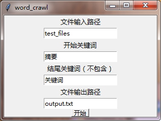
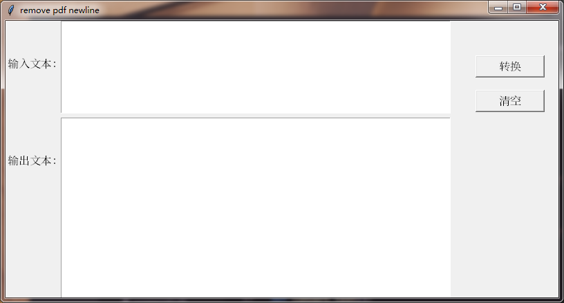

# Collaborative_work_platform

本项目目的是将平时工作涉及的重复性工作进行自动化处理，根据个人的需要不定期更新。目前能力有限，只能做一些简单的功能。

## word_crawl

用于获取**word**文档中，设置特点开始关键词和结束关键词，保存关键词之间的内容。程序可批量处理一个文件夹中的所有**.docx/dox**文件，并输出**.txt**文件记录每个文件名及对应的内容。

### 用法

**文件输入路径**：word文件所在的文件夹。当路径中不包含“/”时，为相对路径，从程序所在路径寻找文件夹；当路径中包含“/”时，为绝对路径，包括了文件夹的完整路径。

**开始关键词**：word文件读取到以该关键词为开头的段落时，开始保存该段落及其随后段落。

**结尾关键词（不包含）**：word文件读取到以该关键词为开头的段落时，结束读取操作。

**文件输出路径**：输出txt文件的路径。类似文件输入路径，有两种模式。

## remove pdf newline

从*pdf*文件中复制的文字会保持*pdf*的显示格式，出现很多换行符。这些换行符往往是多余的，使得一句完整的话分割开来。该程序用于去除pdf文本的换行符。将需要复制的pdf文本粘贴到**输入文本**框，点击**转换**按钮即可在**输出文本**框获得无换行符的文本。

